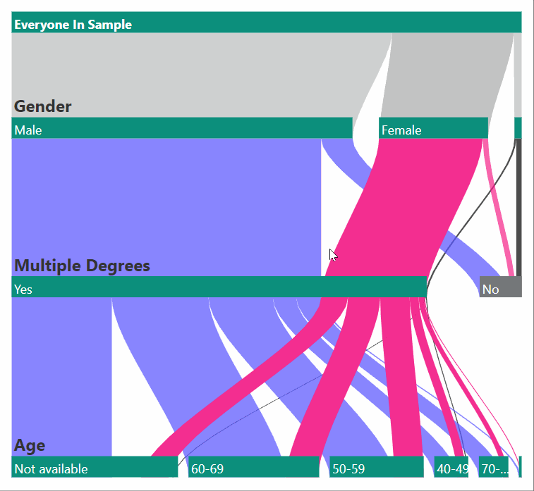

# PowerBI-visuals-Tassels

_An interactive parallel sets based visual slicer for exploring Power BI reports._



## How to use

For examples on how to use please refer to the sample report in the demo folder names `Wishyoulization-Tassels-Slicer-Custom-Visual-Demo.pbix` It demonstrates the visual and its various usecases and configuration setups.

## Build Process
This visual features a two phase build process for easy debugging, i.e. we first build the visual as a web component and create a `App.js` and in the second phase we build the Power BI visual in the `pbiviz` folder.

```
git clone https://github.com/wishyoulization/PowerBI-visuals-Tassels.git
cd PowerBI-visuals-Tassels
npm install
cd pbiviz
npm install
npm run-script package
```

When developing locally in a browser.
```
cd PowerBI-visuals-Tassels
npm run-script start
```

When developing locally for PowerBI debugger (Please refer to the Power BI Custom Visual Development Guide for more details on how to setup build tools).
```
cd PowerBI-visuals-Tassels
cd pbiviz
npm run-script start
```
